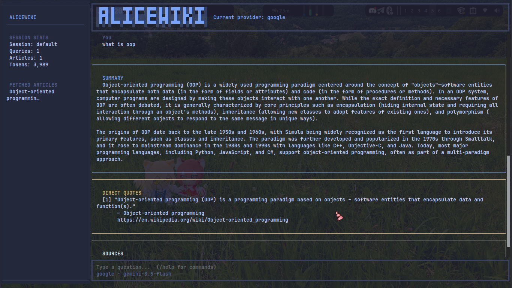

# AliceWiki

A terminal AI chatbot that fetches information from Wikipedia API using LangChain.

## Requirements

- [Bun](https://bun.sh) 1.2+
- An API key for OpenAI, Anthropic, or Google

## Installation

```bash
bun install -g alicewiki
```

## Configuration

Bun automatically loads `.env` from the current directory. Create a `.env` file:

```bash
# Required - at least one API key
OPENAI_API_KEY=your_key
ANTHROPIC_API_KEY=your_key
GOOGLE_API_KEY=your_key

# Add default provider
DEFAULT_PROVIDER=openai  # openai, anthropic, google
```

## Usage

```bash
# Chatbot/Agentic mode (need llm api key)
aw

# One-liner mode (doesn't need llm api key)
aw who is mary sue?
```

## Commands (Interactive Mode)

- `/help` - Show help
- `/switch <provider>` - Switch LLM provider (openai, anthropic, google)
- `/model <name>` - Change model for current provider
- `/quit` - Exit

## Architecture

```
src/
  index.ts          Entry point. Routes to one-liner (CLI args) or interactive TUI.
  tui.tsx           React root component. Creates renderer, manages app state (messages,
                    provider, token tracking, sidebar stats), handles keyboard bindings.
  one-liner.ts      Bypasses LLM: fetches Wikipedia directly, prints title+extract+URL.
  llm.ts            Creates LangChain models per provider (openai/anthropic/google).
  agent.ts          Agent orchestrator: runs LLM with tool calling (max 2 loops),
                    parses JSON output, returns token usage metadata.
  components/
    Header.tsx        ASCII logo + current provider name.
    Sidebar.tsx       Session stats (queries, articles, token count), fetched articles,
                      keybinding hints. Receives all data as props.
    Messages.tsx      Scrollable message list container.
    MessageTurn.tsx   Single turn: user query box + response (summary, quotes, sources, help)
                      with sequential typewriter animation. Help text uses a green-bordered box.
    InputBar.tsx      Text input + status line (provider · model). Detaches submit
                      during processing (input guard) to prevent query spam.
    TypewriterText.tsx Char-by-char text reveal component via useEffect interval.
  tools/
    wikipedia.ts    Fetches Wikipedia via `wikipedia` npm package, returns JSON.
```
